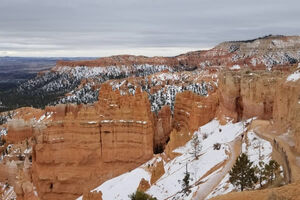

+++
title = 'Imagens responsivas sem perder o contexto'
description = 'Um pipeline de imagens deve preservar significado, proporção e estabilidade em qualquer tela.'
date = 2023-03-15T11:00:00-07:00
draft = false
tags = ['hugo', 'imagens']
categories = ['desenvolvimento']
comments = true
+++

Uma imagem editorial precisa chegar na dimensão adequada, sem deslocar o texto e sem perder sua
descrição. Hugo pode produzir variantes durante o build, deixando o navegador escolher a melhor delas.

O texto alternativo descreve a informação visual relevante. A legenda acrescenta contexto editorial,
enquanto largura e altura reservam o espaço correto antes mesmo de a imagem terminar de carregar.
